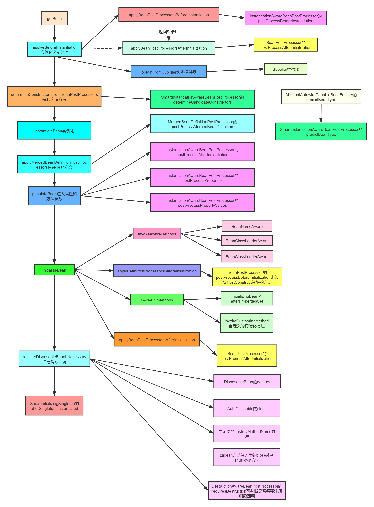

# Bean-IOC流程
## refresh()
>**创建beanFactory**\
>ConfigurableListableBeanFactory beanFactory = obtainFreshBeanFactory();\
>**预初始化bean工厂**\
>prepareBeanFactory(beanFactory);\
>**bean工厂扩展**\
>invokeBeanFactoryPostProcessors(beanFactory);\
>**后置处理器注册**\
>registerBeanPostProcessors(beanFactory);\
>**完成bean工厂实例化，初始化bean**\
>finishBeanFactoryInitialization
## 预实例化bean-preInstantiateSingletons
>getMergedLocalBeanDefinition -> 合并BD为rootBD\

**①对rootBD进行条件判断，满足条件!bd.isAbstract() && bd.isSingleton() && !bd.isLazyInit() 单例非懒加载的非抽象bean时就会开始创建bean实例**\
**②初始化时通过rootBD操作bean进行实例化**\
**FactoryBean**

**bean**
>getBean(beanName)：从缓存中获取bean，首先会根据beanName获取bean，此步是从缓存中获取\
doGetBean(name, null, null, false);\
getSingleton(beanName)：根据名称从三级缓存中获取bean ->  isSingletonCurrentlyInCreation：从缓存容器中检查bean是否正在创建中; return singletonObject->null\
>>当缓存中无法获取到bean信息时开始实例化bean的流程\
>getParentBeanFactory()：递归处理父bean todo\
RootBeanDefinition mbd = getMergedLocalBeanDefinition(beanName); 合并BeanDefinition\
checkMergedBeanDefinition(mbd, beanName, args); 检查合并后的BeanDefinition不允许抽象类的BeanDefinition\
mbd.getDependsOn(); 存在@DependsOn或者xml定义depends-on的的标签
>> - registerDependentBean(dep, beanName); 注册DependsOn中依赖的bean
>> - getBean(dep); 递归，优先处理DependsOn中的bean
## 实例化bean
> **单例bean**\
>getSingleton -> createBean \
sharedInstance = getSingleton(beanName,()->{ \
&nbsp;&nbsp;&nbsp;&nbsp;
return createBean(beanName, mbd, args); \
})

### 创建bean实例-createBean
>**非spring容器中的Bean**\
Object bean = resolveBeforeInstantiation(beanName, mbdToUse); 实例化bean前调用后置处理器处理bean信息,包括实例化和初始化过程\
非spring管理的bean的创建过程交给spring,由InstantiationAwareBeanPostProcessor负责bean的实例化 -> InstantiationAwareBeanPostProcessor#postProcessBeforeInstantiation\
由BeanPostProcessor负责bean的初始化--> postProcessAfterInitialization\
这部分bean返回后不再参与doCreateBean过程\
为什么spring是在初始化之后proxy而不是resolveBeforeInstantiation?
> 
>**spring容器中的Bean**\
Object beanInstance = doCreateBean(beanName, mbdToUse, args);

### doCreateBean
>createBeanInstance 获取bean对象
>- Constructor<?>[] ctors = determineConstructorsFromBeanPostProcessors(beanClass, beanName); 解析LookUp，解析合适的构造函数，见代码注释
>- autowireConstructor dcfbp返回非null的构造函数进行注入 将注入对象封装成BeanWrapper返回
>- instantiateBean(beanName, mbd); 当不存在合适的构造函数时，就通过反射获取对象，封装成BeanWrapper

### 循环依赖条件判断
>boolean earlySingletonExposure  ->true  addSingletonFactory(beanName, () -> getEarlyBeanReference(beanName, mbd, bean));
- 如果允许循环依赖，则提前暴露bean到singletonFactories三级缓存中

### populateBean
>InstantiationAwareBeanPostProcessor#postProcessAfterInstantiation(Object bean, String beanName)
>- bean实例化后对bean进行属性填充时进行调用判断，处理实例化bean信息，当返回false时不会populateBean
>- 在需要对bean自定义属性填充时可在此处完善bean填充信息然后返回false或者添加bean的支持后继续进行属性填充

AutowiredMode 注入模型
对没有实现@Autowired、 @Resource注解的情况下，对Bean实例进行注入的集中方式,在invokeBeanFactoryPostProcessors阶段，获取指定bean的abd，操作abd注入模型
- AUTOWIRE_BY_NAME->autowireByName(beanName, mbd, bw, newPvs);
- AUTOWIRE_BY_NAME->autowireByType(beanName, mbd, bw, newPvs);

InstantiationAwareBeanPostProcessor 实例化对象后对对象依赖进行处理
applyPropertyValues(beanName, mbd, bw, pvs); 属性值注入
- PropertyValues:

### applyPropertyValues
todo 
## 初始化bean
>exposedObject = initializeBean(beanName, exposedObject, mbd);
### Aware方法处理
>invokeAwareMethods(beanName, bean); -> setxxx
>- BeanNameAware
>- BeanClassLoaderAware
>- BeanFactoryAware
### 初始化前调用后置处理器 postProcessBeforeInitialization-部分Aware处理
>wrappedBean = applyBeanPostProcessorsBeforeInitialization(wrappedBean, beanName);
-> BeanPostProcessor#postProcessBeforeInitialization
初始化前对bean进行扩充，比如调用某些Aware接口的set方法获取容器中的资源(环境Aware、资源加载器Aware、事件发布管理器Aware、消息Aware、ApplicationContextAware等等)
### 配置初始化方法调用invokeInitMethods
>invokeInitMethods(beanName, wrappedBean, mbd);
>- 调用InitializingBean实现类的afterPropertiesSet()方法
>- 处理xml中的init-method指定方法
### 初始化后调用后置处理器 postProcessAfterInitialization
>wrappedBean = applyBeanPostProcessorsAfterInitialization(wrappedBean, beanName);
-> BeanPostProcessor#postProcessAfterInitialization

### 执行完上述流程后返回到getSingleton

#流程图
<!--  -->